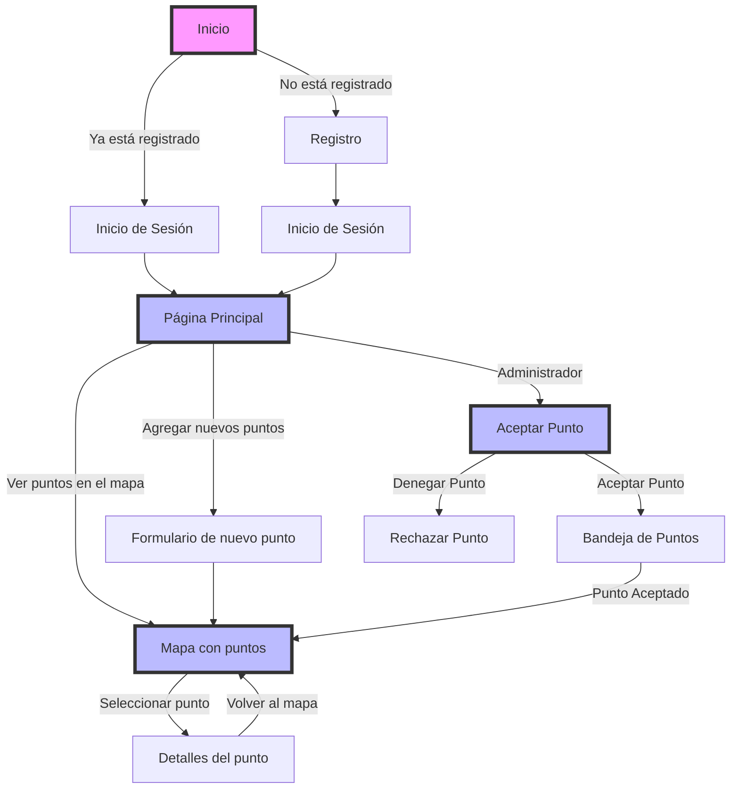

# AquaTravel
Este proyecto React implementa un mapa, mostrando sitios relacionados con el agua. Los usuarios pueden registrarse para acceder para registrar sus propios sitios.
## Funcionalidades
- Mapa: Los usuarios pueden explorar el mapa que muestra diferentes puntos relacionados con el agua.
- Registro: Los usuarios pueden registrarse para poder registrar sus propios puntos.
- PopUps: Los popups son los puntos añadidos por los usuarios donde se indica su dirección exacta y foto del lugar.

## Tecnologias Utilizadas
- React
- React Leaflet
- Firebase
- Bootstrap
- Mongo

# Diagrama de Uso

## Autor
Felipe González Muñoz
